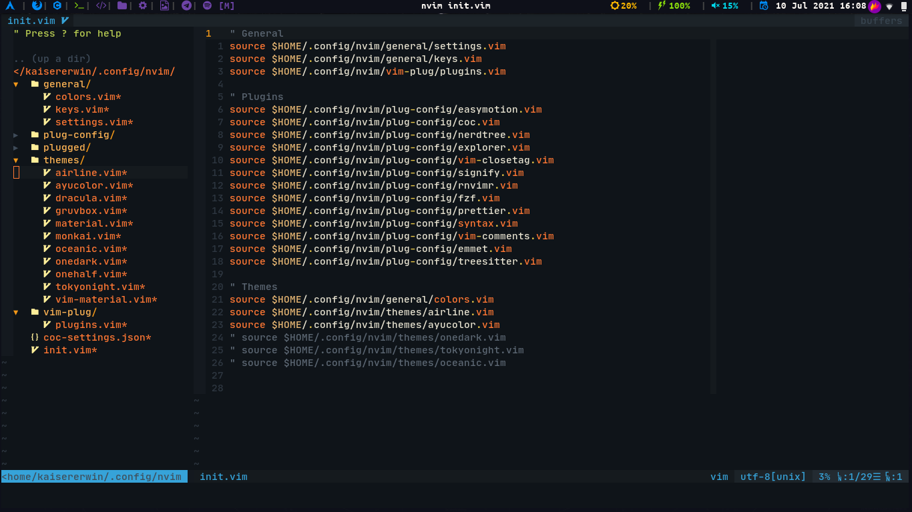

```sh
# ArchLinux
sudo pacman -S nodejs npm python python-pip ruby rubygems xsel fzf ripgrep fd prettier --noconfirm

# Download neovim packages
pip install neovim
gem install neovim
sudo npm i -g neovim

# Vim-plug
sh -c 'curl -fLo "${XDG_DATA_HOME:-$HOME/.local/share}"/nvim/site/autoload/plug.vim --create-dirs \
       https://raw.githubusercontent.com/junegunn/vim-plug/master/plug.vim'
       
# My Neovim
https://github.com/KaiserErwin/dotfiles
cp -r dotfiles/nvim ~/.config/nvim
```

Then execute ```:PlugInstall``` inside neovim and it should be ready.
