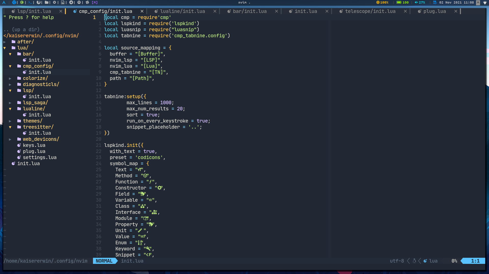

```sh
# ArchLinux
paru -S eslint standard cmake-language-server \
  nodejs npm python python-pip ruby rubygems xsel fzf ripgrep fd \ 
  prettier bash-language-server haskell-language-server lua-language-server --noconfirm

# Download neovim packages
pip install neovim
gem install neovim
sudo npm i -g neovim vscode-css-languageservice vscode-json-languageservice vscode-html-languageservice \ 
  n prettier elm elm-format  @elm-tooling/elm-language-server @tailwindcss/language-server bash-language-server \
  typescript-language-server vscode-langservers-extracted yaml-language-server

# Packer.nvim
git clone --depth 1 https://github.com/wbthomason/packer.nvim\
 ~/.local/share/nvim/site/pack/packer/start/packer.nvim
       
# My Neovim
git clone https://github.com/KaiserErwin/dotfiles.git
cp -r dotfiles/nvim ~/.config/nvim
```

Then execute ```:PackerInstall``` inside neovim and it should be ready.

