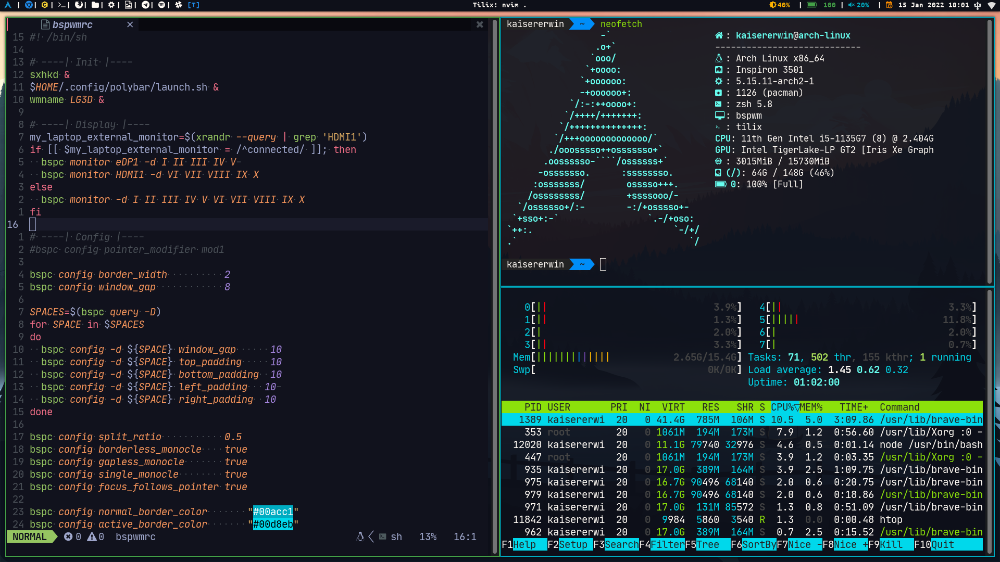
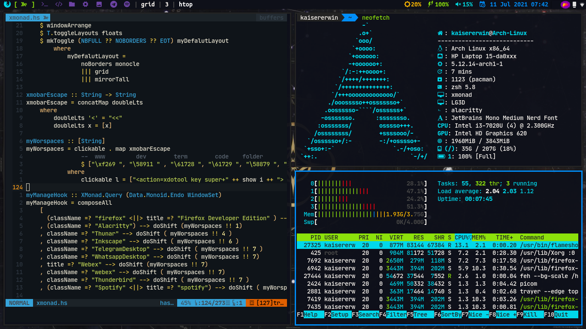
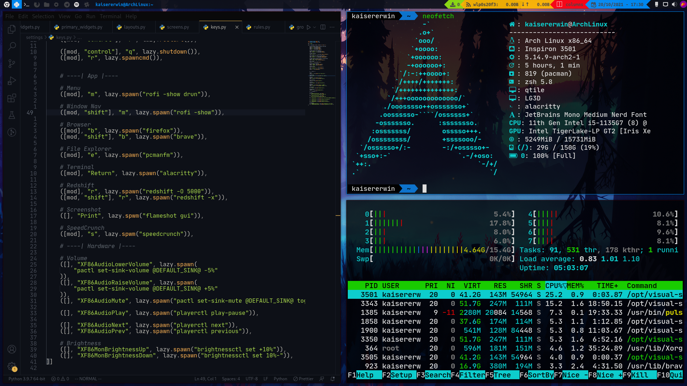

# dotfiles

# Windows manager config

## [Leftwm](https://github.com/BasielusErwin/dotfiles/tree/main/.config/leftwm)


## [BSPWM](https://github.com/BasielusErwin/dotfiles/tree/main/.config/bspwm)



## [Xmonad](https://github.com/BasielusErwin/dotfiles/tree/main/.xmonad)



## [Qtile](https://github.com/BasielusErwin/dotfiles/tree/main/.config/qtile)



- My config's
  - [Neovim](https://github.com/BasielusErwin/dotfiles/tree/main/.config/nvim)
  - [Neofetch](https://github.com/BasielusErwin/dotfiles/tree/main/.config/neofetch)
  - [Zathura](https://github.com/BasielusErwin/dotfiles/tree/main/.config/zathura)
  - [Ranger](https://github.com/BasielusErwin/dotfiles/tree/main/.config/ranger)
  - [Picom](https://github.com/BasielusErwin/dotfiles/tree/main/.config/picom)
  - [Bat](https://github.com/BasielusErwin/dotfiles/tree/main/.config/bat)
  - [Polybar](https://github.com/BasielusErwin/dotfiles/tree/main/.config/polybar)
  - [Alacritty](https://github.com/BasielusErwin/dotfiles/tree/main/.config/alacritty)


## Use
```sh
  git clone --bare https://github.com/BasielusErwin/dotfiles.git .dotfiles
  git --git-dir ./.dotfiles --work-tree=$HOME reset .
  git --git-dir ./.dotfiles --work-tree=$HOME restore .
```

# Software

## Basic System Software

| Software                                                                                            | Utility                                                          |
| --------------------------------------------------------------------------------------------------- | ---------------------------------------------------------------- |
| **[networkmanager](https://wiki.archlinux.org/index.php/NetworkManager)**                           | Self explanatory                                                 |
| **[network-manager-applet](https://wiki.archlinux.org/index.php/NetworkManager#nm-applet)**         | _NetworkManager_ systray                                         |
| **[pulseaudio](https://wiki.archlinux.org/index.php/PulseAudio)**                                   | Self explanatory                                                 |
| **[pavucontrol](https://www.archlinux.org/packages/extra/x86_64/pavucontrol/)**                     | _pulseaudio_ GUI                                                 |
| **[pamixer](https://www.archlinux.org/packages/community/x86_64/pamixer/)**                         | _pulseaudio_ CLI                                                 |
| **[brightnessctl](https://www.archlinux.org/packages/community/x86_64/brightnessctl/)**             | Laptop screen brightness                                         |
| **[xinit](https://wiki.archlinux.org/index.php/Xinit)**                                             | Launch programs before wm starts                                 |
| **[libnotify](https://wiki.archlinux.org/index.php/Desktop_notifications)**                         | Desktop notifications                                            |
| **[notification-daemon](https://www.archlinux.org/packages/community/x86_64/notification-daemon/)** | Self explanatory                                                 |
| **[udiskie](https://www.archlinux.org/packages/community/any/udiskie/)**                            | Automounter                                                      |
| **[ntfs-3g](https://wiki.archlinux.org/index.php/NTFS-3G)**                                         | NTFS read & write                                                |
| **[arandr](https://www.archlinux.org/packages/community/any/arandr/)**                              | GUI for _xrandr_                                                 |
| **[cbatticon](https://www.archlinux.org/packages/community/x86_64/cbatticon/)**                     | Battery systray                                                  |
| **[volumeicon](https://www.archlinux.org/packages/community/x86_64/volumeicon/)**                   | Volume systray                                                   |
| **[glib2](https://www.archlinux.org/packages/core/x86_64/glib2/)**                                  | Trash                                                            |
| **[gvfs](https://www.archlinux.org/packages/extra/x86_64/gvfs/)**                                   | Trash for GUIs                                                   |
| **[Trayer](https://www.archlinux.org/packages/extra/x86_64/trayer/)**                               | Systray                                                          |
| **[Simple-MTPFS](https://aur.archlinux.org/packages/simple-mtpfs/)**                                | A FUSE filesystem that supports reading/writing from MTP devices |
| **[paru](https://aur.archlinux.org/packages/paru/)**                                                | Feature packed AUR helper, write in Rust                         |

## Software I do

| Software                                                                                            | Utility                                                          |
| --------------------------------------------------------------------------------------------------- | ---------------------------------------------------------------- |
| **[Alacritty](https://wiki.archlinux.org/index.php/Alacritty)**                                     | Terminal emulator                                                |
| **[Piper](https://archlinux.org/packages/community/any/piper)**                                     | GTK application to configure gaming mice                         |
| **[Neofetch](https://archlinux.org/packages/community/any/neofetch/)**                              | A CLI system information tool                                    |
| **[Thunar](https://wiki.archlinux.org/index.php/Thunar)**                                           | Graphical file explorer                                          |
| **[Ranger](https://wiki.archlinux.org/index.php/Ranger)**                                           | Terminal based explorer                                          |
| **[Neovim](https://wiki.archlinux.org/index.php/Neovim)**                                           | Terminal based editor                                            |
| **[Rofi](https://wiki.archlinux.org/index.php/Rofi)**                                               | Menu and window switcher                                         |
| **[Flameshot](https://wiki.archlinux.org/title/Flameshot)**                                         | Screenshot                                                       |
| **[Redshift](https://wiki.archlinux.org/index.php/Redshift)**                                       | Blue light filter                                                |
| **[Zathura](https://wiki.archlinux.org/title/Zathura)**                                             | Minimalist PDF viewer                                            |
| **[exa](https://archlinux.org/packages/community/x86_64/exa/)**                                     | ls replacement                                                   |
| **[Bat](https://archlinux.org/packages/community/x86_64/bat/)**                                     | Cat clone with syntax highlighting                               |
| **[ZSH](https://wiki.archlinux.org/title/Zsh)**                                                     | command interpreter                                              |
| **[VLC](https://wiki.archlinux.org/title/VLC_media_player)**                                        | multimedia player                                                |
| **[geeqie](https://archlinux.org/packages/extra/x86_64/geeqie/)**                                   | Lightweight image viewer                                         |

## Fonts, theming

| Software                                                                               | Utility                    |
| -------------------------------------------------------------------------------------- | -------------------------- |
| **[Picom](https://wiki.archlinux.org/index.php/Picom)**                                | Compositor for Xorg        |
| **[UbuntuMono Nerd Font](https://aur.archlinux.org/packages/nerd-fonts-ubuntu-mono/)** | Nerd Font for icons        |
| **[JetBrains Mono Nerd Font](https://aur.archlinux.org/packages/nerd-fonts-jetbrains-mono/)** | Nerd Font for icons        |
| **[Liberation Mono Nerd Font](https://aur.archlinux.org/packages/nerd-fonts-liberation-mono/)** | Nerd Font for icons        |
| **[Material Black](https://www.gnome-look.org/p/1316887/)**                            | GTK theme and icons        |
| **[Papirus Icons](https://archlinux.org/packages/community/any/papirus-icon-theme/)**  | GTK Icons                  |
| **[lxappearance](https://www.archlinux.org/packages/community/x86_64/lxappearance/)**  | GUI for changing themes    |
| **[Nitrogen](https://wiki.archlinux.org/index.php/Nitrogen)**                          | GUI for setting wallpapers |
| **[feh](https://wiki.archlinux.org/index.php/Feh)**                                    | CLI for setting wallpapers |
| **[Oh My ZSH](https://ohmyz.sh/)**                                                     | "Oh My ZSH!"               |
| **[PowerLevel10K](https://github.com/romkatv/powerlevel10k)**                          | Theme for ZSH              |
