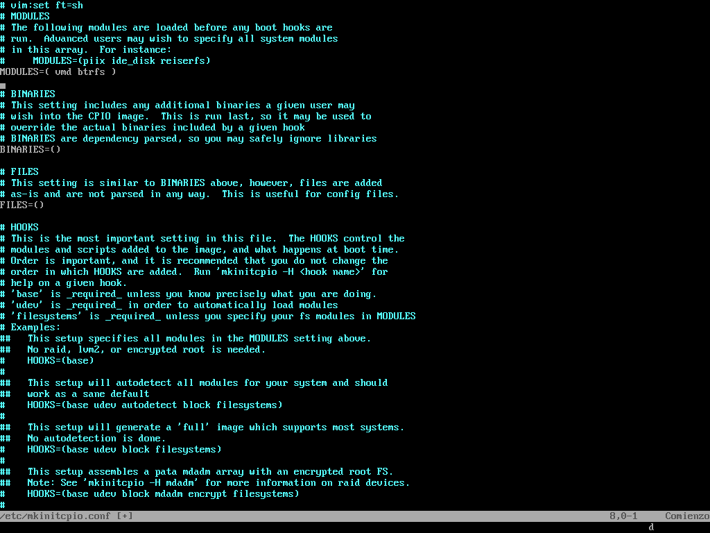

# Introduction

The guide is focused on my PC, Dell Inspiron 5000 3501 11th Gen Intel i5-1135G7 ssd M.2 NVMe dual boot with Windows 10.

# Why Btrfs?

Btrfs is a modern copy on write (CoW) filesystem for Linux aimed at implementing advanced features while also focusing on fault tolerance, repair and easy administration. It’s biggest boon is enabling users to take system snapshots that do not take time to create or restore and barely take up any space on your system.

Since Arch is soo bleeding edge, it is possible that once in a while, due to an update your system breaks. Whenever such faults happen, you can simply roll back on the last snapshot in seconds if you have a BTRFs file system in place.

# Installation Process

Mainly in this guide it is going to list specific things that do not appear directly in the official Arch Linux guide: https://wiki.archlinux.org/index.php/installation_guide

## Partitioning

Arch Linux recommends using `fdisk` but I like it `cfdisk` because it is simpler to use

```bash
   cfdisk /dev/nvme0n1
```

As I already have Windows installer on my PC, the `UEFI` partition is already created and I use that one. The partitions `nvme0n1p1, p2, p3, p4 `are from Windows, and since I did not use swap or home, when creating a new partition it would remain as nvme0n1p5 as root.

## Creating Filesystems

```bash
    mkfs.btrfs -L ROOT /dev/nvme0n1p5
```

## Mounting the partitions and subvolumes

```bash
    mount -L ROOT /mnt
```

Now that we have mounted the root subvolume, we must create subvolumes for btrfs.

```bash
    btrfs su cr /mnt/@

    umount /mnt
```

Now toa mount these partitions:

```bash
    mount -o noatime,commit=120,compress=zstd,space_cache,subvol=@ -L ROOT /mnt

    mkdir -p /mnt/boot/efi

    mount /dev/nvme0n1p1 /mnt/boot/efi
```

Btrfs options:

- noatime - No access time. Improves system performace by not writing time when thefile was accessed.
- commit - Peridoic interval (in sec) in which data is synchronized to permanent storage.
- compress - Choosing the algorithm for compress. I have set zstd as it has good compression level and speed.
- space_cache - Enables kernel to know where block of free space is on a disk to enable it to write data immediately after file creation.
- subvol - Choosing the subvol to mount.

You can read more about btrfs mount options here: https://btrfs.wiki.kernel.org/index.php/Manpage/btrfs(5)

## Installing the base system

For intel CPUs:

```bash
    pacstrap /mnt base base-devel linux linux-firmware neovim intel-ucode btrfs-progs
```

For VMs:

```bash
    pacstrap /mnt base base-devel linux linux-firmware neovim btrfs-progs
```

## Generate fstab

The fstab file is used to define how disk partitions, various other block devices, or remote filesystems should be mounted into the filesystem. Generate it using:

```bash
    genfstab -pU /mnt >> /mnt/etc/fstab
```

## Chroot into install

Now you must enter your Arch install to set it up:

```bash
    arch-chroot /mnt
```

## Installing remaining essential packages

```bash
    pacman -S grub grub-btrfs efibootmgr base-devel linux-headers networkmanager network-manager-applet wpa_supplicant dialog os-prober mtools dosfstools reflector git wget bluez bluez-utils xdg-utils xdg-user-dirs

    modprobe btusb
    systemctl enable bluetooth NetworkManager

```

## Adding module to mkinitcpio

My PC has special settings in the Bios for Windows and to avoid problems with that system, some changes have to be made in the kernel modules.

```bash
   nvim /etc/mkinitcpio.conf
```

Add vmd and btrfs in MODULES=()



In the future to be able to have audio you have to load some mods

```bash
    echo "options snd-intel-dspcfg dsp_driver=1 \
          options snd-hda-intel dmic_detect=0" >> /etc/modprobe.d/alas.conf
```

Now to recreate the image:

```bash
    mkinitcpio -p
```

## Installing GRUB

```bash
    grub-install --target=x86_64-efi --efi-directory=/boot --bootloader-id=Arch
```

Now to generate the configuration file:

```bash
    echo "GRUB_DISABLE_OS_PROBER=false" >> /etc/default/grub
    grub-mkconfig -o /boot/grub/grub.cfg
```

## Restarting into Arch

```bash
    exit

    umount -l /mnt

    shutdown -r now
```

---

# Sources:

[Arch Linux with BTRFS Installation (Base)](https://www.nishantnadkarni.tech/posts/arch_installation/)

[Dell-Inspiron-7567-Arch-Install - UEFI + Encrypt](https://gist.github.com/seteBR/34e3c1461cd715aaab7ee93dfc6f8316)

[Guia de instalacion ArchLinux](https://denovatoanovato.net/instalar-arch-linux/)

[Arch Linux not detecting NVMe storage on boot after installation. Can't boot!](https://www.reddit.com/r/archlinux/comments/lxx54z/arch_linux_not_detecting_nvme_storage_on_boot/)
